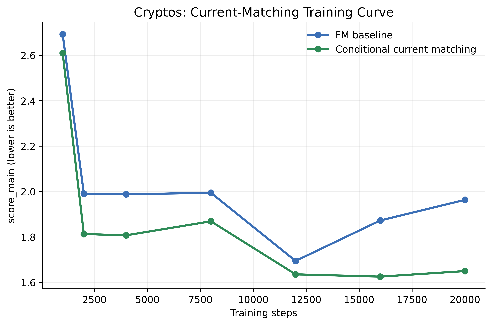
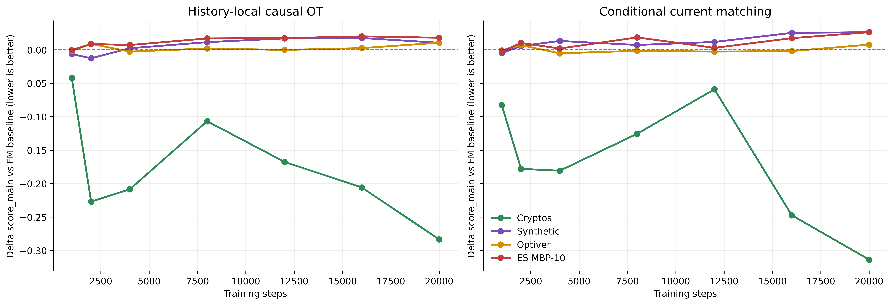

# LoBiFlow

LoBiFlow is a history-conditioned flow-matching model for generating level-2
limit order books. This project includes the training code, benchmark scripts,
dataset preparation utilities, and final experiment artifacts used for the
paper-ready evaluation.

## Scope

- model: conditional L2 LOB generation in parameterized book space
- objective: flow matching with minibatch optimal transport matching
- conditioning: transformer or hybrid history encoder
- evaluation: 4 primary metrics + 7 diagnostic metrics

## Datasets

- LOBSTER-calibrated synthetic data
- Optiver Realized Volatility Prediction
- Binance crypto LOB snapshots from Tardis
- Databento ES futures MBP-10

Prepared non-ES datasets are hosted at
`pixelhero98/lobiflow` on Hugging Face. From the repository root:

```bash
pip install -U huggingface_hub
hf download pixelhero98/lobiflow --repo-type dataset --local-dir .
```

This populates:

- `scripts/data_cryptos/cryptos_binance_spot_monthly_1s_l10.npz`
- `scripts/data_optiver/optiver_train_8stocks_l2.npz`
- `scripts/data_synthetic/lobster_free_sample_profile_10.json`

The ES-MBP-10 raw Databento cache is hosted separately at
`pixelhero98/es-mbp-10`. Download the raw cache, then rebuild the processed
NPZ used by the experiments:

```bash
pip install -U huggingface_hub databento pandas
hf download pixelhero98/es-mbp-10 --repo-type dataset --include "scripts/data_databento/databento_cache/**" --local-dir .
python scripts/prepare_databento.py --cache_root scripts/data_databento/databento_cache --output scripts/data_databento/es_mbp_10.npz
```

If a cached Databento day is missing, `prepare_databento.py` can fetch it when
`DATABENTO_API_KEY` is set. The default ES request is `GLBX.MDP3`, schema
`mbp-10`, symbol `ES.v.0`, continuous stype, `2026-02-10` to `2026-03-10`,
sampled at 1 second.

## Verified Metrics

Primary metrics:

- `TSTR MacroF1`
- `Disc.AUC Gap`
- `Unconditional W1`
- `Conditional W1`

Additional diagnostics:

- `U-L1`
- `C-L1`
- `spread_specific_error`
- `imbalance_specific_error`
- `ret_vol_acf_error`
- `impact_response_error`
- `efficiency_ms_per_sample`

The benchmark summaries also report the composite `score_main` used for model
ranking.

## Main Scripts

- `scripts/experiments_lobiflow.py`: main LoBiFlow runner
- `scripts/benchmark_lobiflow_paper_ready.py`: final quality / speed / architecture benchmark
- `scripts/export_model_metric_catalogs.py`: flat metric catalog export
- `scripts/generate_final_metric_summary.py`: regenerate the published metric summary from the paper-ready catalogs
- `scripts/generate_main_benchmark_latex_table.py`: regenerate the main paper LaTeX benchmark table from the merged benchmark catalog
- `scripts/generate_additional_results_slots.py`: generate the three single-column additional-results slots for the paper body
- `scripts/generate_abstract_aligned_additional_results_slots.py`: generate an alternative abstract-aligned three-slot bundle focused on efficiency and structured regularization outcomes
- `scripts/regularization_training_curve.py`: reproduce structured-regularization training-step sweeps
- `scripts/make_regularization_ablation_plots.py`: generate pilot ablation figures
- `scripts/test_lobiflow.py`: smoke and regression suite

## Usage

Run the main LoBiFlow suite with dataset-specific defaults:

```bash
cd scripts
python experiments_lobiflow.py --dataset synthetic --out_dir results_synth
python experiments_lobiflow.py --dataset optiver --out_dir results_optiver
python experiments_lobiflow.py --dataset cryptos --out_dir results_cryptos
python experiments_lobiflow.py --dataset es_mbp_10 --out_dir results_es
```

Run the faster `NFE=1` speed variant:

```bash
cd scripts
python experiments_lobiflow.py --dataset cryptos --lobiflow_variant speed --out_dir results_cryptos_speed
```

Run the paper-ready benchmark bundle:

```bash
cd scripts
python benchmark_lobiflow_paper_ready.py
```

Export flat CSV/JSON metric catalogs:

```bash
cd scripts
python export_model_metric_catalogs.py
```

## Hyperparameter Tuning

LoBiFlow applies dataset presets first, then CLI overrides. The main knobs are:

- data: `--dataset`, `--data_path`, `--synthetic_length`
- optimization: `--steps`, `--batch_size`, `--lr`, `--weight_decay`
- context: `--history_len`, `--ctx_encoder`, `--ctx_causal`, `--ctx_local_kernel`, `--ctx_pool_scales`
- sampling: `--eval_nfe`, `--solver`, `--lobiflow_variant`
- evaluation: `--eval_horizon`, `--rollout_horizons`, `--eval_windows_*`

Typical examples:

```bash
cd scripts
python experiments_lobiflow.py --dataset cryptos --history_len 384 --ctx_encoder hybrid --ctx_local_kernel 7 --ctx_pool_scales 8,32
python experiments_lobiflow.py --dataset optiver --eval_nfe 4 --solver dpmpp2m
python experiments_lobiflow.py --dataset synthetic --synthetic_length 5000000 --steps 20000
```

Published paper-ready quality presets:

- `synthetic`: `transformer`, `history_len=128`, `solver=euler`, `eval_nfe=2`
- `optiver`: `transformer`, `history_len=128`, `solver=dpmpp2m`, `eval_nfe=4`
- `cryptos`: `hybrid`, `history_len=256`, `solver=dpmpp2m`, `eval_nfe=1`
- `es_mbp_10`: `hybrid`, `history_len=256`, `solver=euler`, `eval_nfe=1`

## Final Outputs

Paper-ready benchmark outputs are written under:

- `scripts/results_benchmark_lobiflow_paper_ready_20260315`
- `scripts/results_model_metric_catalogs_20260316`
- `scripts/results_regularization_ablation_20260324`
- `scripts/results_additional_results_slots_20260409`
- `scripts/results_additional_results_slots_abstract_aligned_20260409`

The flat CSVs in `results_model_metric_catalogs_20260316` are the easiest entry
point for comparing LoBiFlow against all baselines.

Key summaries:

- `scripts/results_benchmark_lobiflow_paper_ready_20260315/final_metric_summary.md`
- `scripts/results_benchmark_lobiflow_paper_ready_20260315/main_benchmark_table.tex`
- `scripts/results_additional_results_slots_20260409/slot1_lobiflow_variant_ablation.tex`
- `scripts/results_additional_results_slots_20260409/slot2_regularization_diagnostics.png`
- `scripts/results_additional_results_slots_20260409/slot3_optiver_field_efficiency.tex`
- `scripts/results_additional_results_slots_abstract_aligned_20260409/slot1_efficiency_tradeoff.tex`
- `scripts/results_additional_results_slots_abstract_aligned_20260409/slot2_causal_ot_results.pdf`
- `scripts/results_additional_results_slots_abstract_aligned_20260409/slot2_causal_ot_results.tex`
- `scripts/results_additional_results_slots_abstract_aligned_20260409/slot3_current_matching_results.pdf`
- `scripts/results_additional_results_slots_abstract_aligned_20260409/slot3_current_matching_results.tex`
- `scripts/results_regularization_ablation_20260324/structured_conditional_regularization_ablation.md`

## Structured Conditional Regularization Ablation

We evaluated several structured conditional regularizers on top of the final
LoBiFlow architecture:

- history-local causal OT
- global causal OT
- conditional current matching
- MI regularization
- path-space conditional FM

The conclusion is narrow but useful:

- none of these regularizers replaced the accepted final LoBiFlow defaults
- history-local causal OT was the strongest candidate
- its benefits were dataset-specific and strongest on `cryptos`
- the fresh 20k sweep shows both local causal OT and conditional current matching help `cryptos`, but not the other three datasets

The detailed summary and supporting diagnostics are in:

- `scripts/results_regularization_ablation_20260324/structured_conditional_regularization_ablation.md`
- `scripts/results_regularization_ablation_20260324/structured_conditional_regularization_ablation.json`
- `scripts/results_regularization_ablation_20260324/causal_ot_applicability.png`
- `scripts/results_regularization_ablation_20260324/current_matching_applicability.png`
- `scripts/results_regularization_ablation_20260324/causal_ot_checkpoint_curve_cryptos.png`
- `scripts/results_regularization_ablation_20260324/current_matching_checkpoint_curve_cryptos.png`
- `scripts/results_regularization_ablation_20260324/regularization_training_delta_20k.png`
- `scripts/results_regularization_ablation_20260324/regularization_training_delta_20k.pdf`
- `scripts/results_regularization_ablation_20260324/structured_regularization_ablation_2x2.pdf`

Pilot figures:





