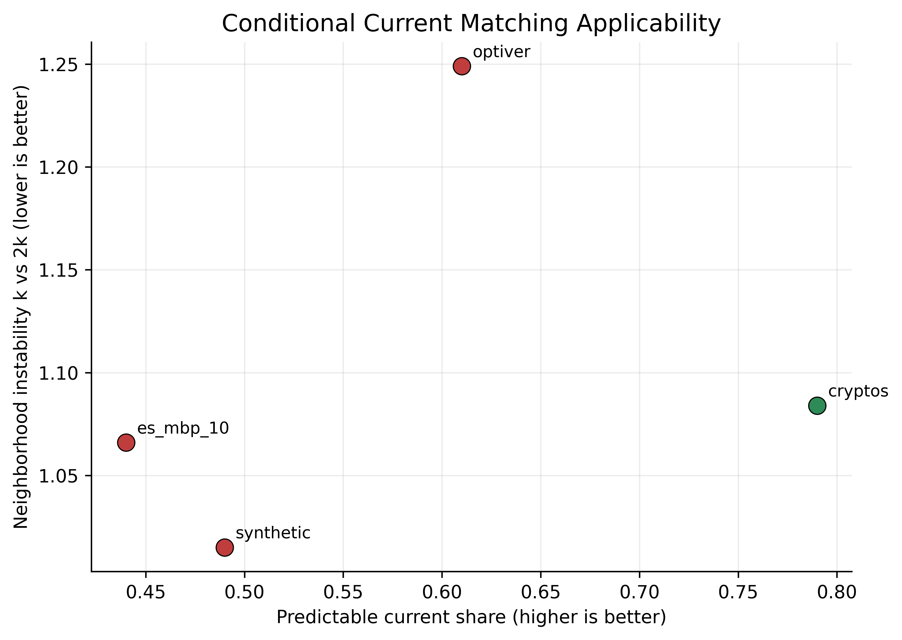

# LoBiFlow

LoBiFlow is a history-conditioned flow-matching model for generating level-2
limit order books. This repository contains the public training code,
benchmark runners, dataset preparation utilities, and compact result artifacts
used for the paper-ready evaluation.

## Scope

- model: conditional L2 LOB generation in parameterized book space
- objective: flow matching with minibatch optimal transport matching
- conditioning: transformer or hybrid history encoder
- evaluation: 4 primary metrics + 7 diagnostic metrics

## Repository Layout

- `code/lobiflow/datasets/`: dataset loaders and preparation utilities
- `code/lobiflow/models/`: LoBiFlow, baselines, conditioning modules, and configs
- `code/lobiflow/trainers/`: training, evaluation, benchmarks, and sweeps
- `code/lobiflow/utils/`: metrics, tables, catalogs, and plot generators
- `code/lobiflow/tests/`: smoke and regression tests
- `data/`: local prepared datasets and raw caches; not tracked except compact public metadata
- `results/`: curated paper and ablation artifacts with stable public names

Set `PYTHONPATH=code` when running modules from a source checkout.

## Datasets

Supported datasets:

- LOBSTER-calibrated synthetic data
- Optiver Realized Volatility Prediction
- Binance crypto LOB snapshots from Tardis
- Databento ES futures MBP-10

Prepared non-ES datasets are hosted at `pixelhero98/lobiflow` on Hugging Face.
From the repository root:

```bash
pip install -U huggingface_hub
hf download pixelhero98/lobiflow --repo-type dataset --local-dir .
```

This populates:

- `data/cryptos/cryptos_binance_spot_monthly_1s_l10.npz`
- `data/optiver/optiver_train_8stocks_l2.npz`
- `data/synthetic/lobster_free_sample_profile_10.json`

The ES-MBP-10 raw Databento cache is hosted separately at
`pixelhero98/es-mbp-10`. Download the raw cache, then rebuild the processed NPZ
used by the experiments:

```bash
pip install -U huggingface_hub databento pandas
hf download pixelhero98/es-mbp-10 --repo-type dataset --include "data/databento/databento_cache/**" --local-dir .
PYTHONPATH=code python -m lobiflow.datasets.prepare_databento --cache_root data/databento/databento_cache --output data/databento/es_mbp_10.npz
```

If a cached Databento day is missing, `prepare_databento` can fetch it when
`DATABENTO_API_KEY` is set. The default ES request is `GLBX.MDP3`, schema
`mbp-10`, symbol `ES.v.0`, continuous stype, `2026-02-10` to `2026-03-10`,
sampled at 1 second.

## Verified Metrics

Primary metrics:

- `TSTR MacroF1`
- `Disc.AUC Gap`
- `Unconditional W1`
- `Conditional W1`

Additional diagnostics:

- `U-L1`
- `C-L1`
- `spread_specific_error`
- `imbalance_specific_error`
- `ret_vol_acf_error`
- `impact_response_error`
- `efficiency_ms_per_sample`

The benchmark summaries also report the composite `score_main` used for model
ranking.

## Public Commands

Main training and evaluation runner:

```bash
PYTHONPATH=code python -m lobiflow.trainers.experiments_lobiflow --dataset synthetic --out_dir results/synthetic_main
PYTHONPATH=code python -m lobiflow.trainers.experiments_lobiflow --dataset optiver --out_dir results/optiver_main
PYTHONPATH=code python -m lobiflow.trainers.experiments_lobiflow --dataset cryptos --out_dir results/cryptos_main
PYTHONPATH=code python -m lobiflow.trainers.experiments_lobiflow --dataset es_mbp_10 --out_dir results/es_mbp_10_main
```

Faster `NFE=1` speed variant:

```bash
PYTHONPATH=code python -m lobiflow.trainers.experiments_lobiflow --dataset cryptos --lobiflow_variant speed --out_dir results/cryptos_speed
```

Paper-ready benchmark and result regeneration:

```bash
PYTHONPATH=code python -m lobiflow.trainers.benchmark_lobiflow_paper_ready
PYTHONPATH=code python -m lobiflow.utils.export_model_metric_catalogs
PYTHONPATH=code python -m lobiflow.utils.generate_final_metric_summary
PYTHONPATH=code python -m lobiflow.utils.generate_main_benchmark_latex_table
PYTHONPATH=code python -m lobiflow.utils.generate_additional_results_slots
PYTHONPATH=code python -m lobiflow.utils.generate_abstract_aligned_additional_results_slots
PYTHONPATH=code python -m lobiflow.utils.make_regularization_ablation_plots
```

Structured regularization sweep:

```bash
PYTHONPATH=code python -m lobiflow.trainers.regularization_training_curve \
  --dataset cryptos \
  --variants baseline_fm,local_causal_ot,conditional_current_matching \
  --seeds 0,1,2 \
  --checkpoints 1000,2000,4000,8000,12000,16000,20000 \
  --out_root results/regularization_ablation/training_curve_cryptos_20k
```

Smoke and regression tests:

```bash
PYTHONPATH=code python -m pytest code/lobiflow/tests/test_lobiflow.py
```

## Hyperparameter Tuning

LoBiFlow applies dataset presets first, then CLI overrides. The main knobs are:

- data: `--dataset`, `--data_path`, `--synthetic_length`
- optimization: `--steps`, `--batch_size`, `--lr`, `--weight_decay`
- context: `--history_len`, `--ctx_encoder`, `--ctx_causal`, `--ctx_local_kernel`, `--ctx_pool_scales`
- sampling: `--eval_nfe`, `--solver`, `--lobiflow_variant`
- evaluation: `--eval_horizon`, `--rollout_horizons`, `--eval_windows_*`

Typical examples:

```bash
PYTHONPATH=code python -m lobiflow.trainers.experiments_lobiflow --dataset cryptos --history_len 384 --ctx_encoder hybrid --ctx_local_kernel 7 --ctx_pool_scales 8,32
PYTHONPATH=code python -m lobiflow.trainers.experiments_lobiflow --dataset optiver --eval_nfe 4 --solver dpmpp2m
PYTHONPATH=code python -m lobiflow.trainers.experiments_lobiflow --dataset synthetic --synthetic_length 5000000 --steps 20000
```

Published paper-ready quality presets:

- `synthetic`: `transformer`, `history_len=128`, `solver=euler`, `eval_nfe=2`
- `optiver`: `transformer`, `history_len=128`, `solver=dpmpp2m`, `eval_nfe=4`
- `cryptos`: `hybrid`, `history_len=256`, `solver=dpmpp2m`, `eval_nfe=1`
- `es_mbp_10`: `hybrid`, `history_len=256`, `solver=euler`, `eval_nfe=1`

## Final Outputs

Curated public artifacts are stored under:

- `results/benchmark_lobiflow_paper_ready/`
- `results/model_metric_catalogs/`
- `results/regularization_ablation/`
- `results/additional_results_slots/`
- `results/additional_results_slots_abstract_aligned/`
- `results/optiver_resmlp_confirm/`

The flat CSVs in `results/model_metric_catalogs/` are the easiest entry point
for comparing LoBiFlow against all baselines.

Key summaries:

- `results/benchmark_lobiflow_paper_ready/final_metric_summary.md`
- `results/benchmark_lobiflow_paper_ready/main_benchmark_table.tex`
- `results/additional_results_slots/slot1_lobiflow_variant_ablation.tex`
- `results/additional_results_slots/slot2_regularization_diagnostics.png`
- `results/additional_results_slots/slot3_optiver_field_efficiency.tex`
- `results/additional_results_slots_abstract_aligned/slot1_efficiency_tradeoff.tex`
- `results/additional_results_slots_abstract_aligned/slot2_causal_ot_results.pdf`
- `results/additional_results_slots_abstract_aligned/slot2_causal_ot_results.tex`
- `results/additional_results_slots_abstract_aligned/slot3_current_matching_results.pdf`
- `results/additional_results_slots_abstract_aligned/slot3_current_matching_results.tex`
- `results/regularization_ablation/structured_conditional_regularization_ablation.md`

## Structured Conditional Regularization Ablation

We evaluated several structured conditional regularizers on top of the final
LoBiFlow architecture:

- history-local causal OT
- global causal OT
- conditional current matching
- MI regularization
- path-space conditional FM

The conclusion is narrow but useful:

- none of these regularizers replaced the accepted final LoBiFlow defaults
- history-local causal OT was the strongest candidate
- its benefits were dataset-specific and strongest on `cryptos`
- the fresh 20k sweep shows both local causal OT and conditional current matching help `cryptos`, but not the other three datasets

The detailed summary and supporting diagnostics are in:

- `results/regularization_ablation/structured_conditional_regularization_ablation.md`
- `results/regularization_ablation/structured_conditional_regularization_ablation.json`
- `results/regularization_ablation/causal_ot_applicability.png`
- `results/regularization_ablation/current_matching_applicability.png`
- `results/regularization_ablation/causal_ot_checkpoint_curve_cryptos.png`
- `results/regularization_ablation/current_matching_checkpoint_curve_cryptos.png`
- `results/regularization_ablation/regularization_training_delta_20k.png`
- `results/regularization_ablation/regularization_training_delta_20k.pdf`
- `results/regularization_ablation/structured_regularization_ablation_2x2.pdf`

Training-curve inputs are stored in stable per-dataset directories:

- `results/regularization_ablation/training_curve_cryptos_20k/`
- `results/regularization_ablation/training_curve_synthetic_20k/`
- `results/regularization_ablation/training_curve_optiver_20k/`
- `results/regularization_ablation/training_curve_es_mbp_10_20k/`

Pilot figures:





