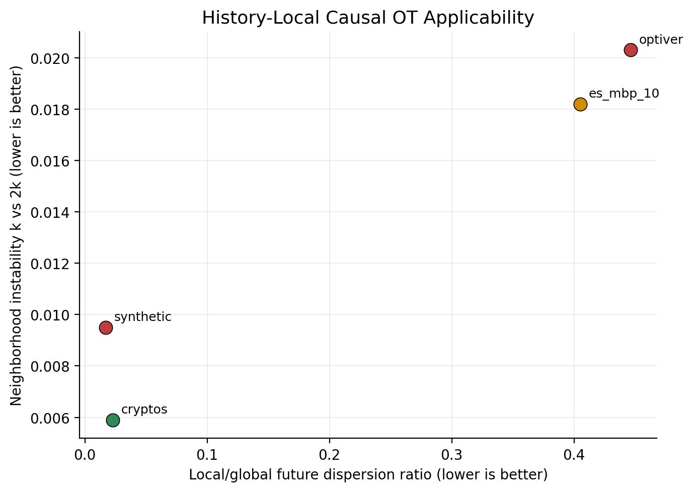
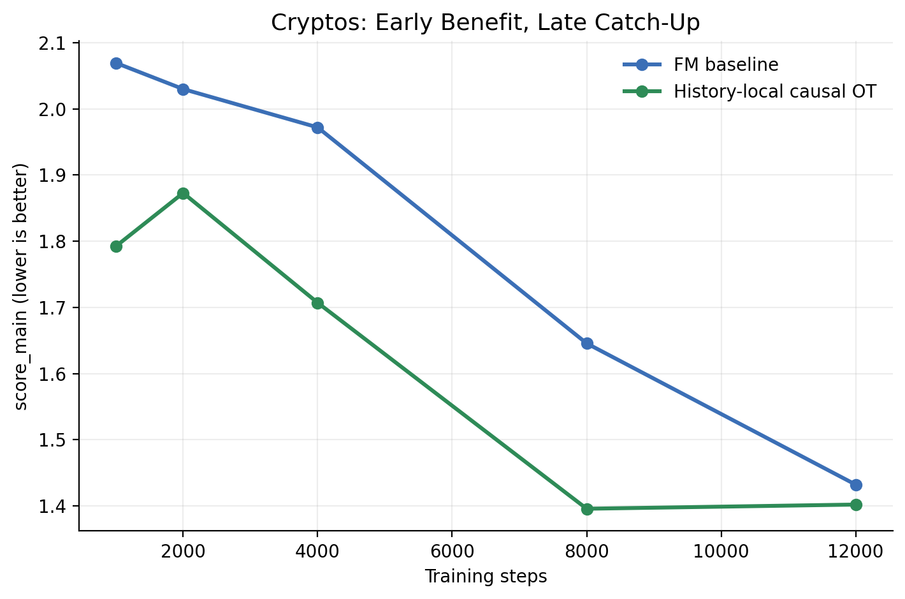

# Structured Conditional Regularization Ablation

This study summarizes the follow-up regularizers added on top of the final
LoBiFlow architecture. "Structured conditional regularization" is the precise
term here: these losses encode explicit assumptions about conditional trajectory
structure, irreversibility, or history-local future coupling.

## Evaluated Regularizers

| Regularizer | Main result | Status |
| --- | --- | --- |
| History-local causal OT | strongest candidate; helps early on `cryptos`, weak/mixed elsewhere | not promoted to default |
| Global causal OT | helps `cryptos`, hurts `optiver` | not promoted to default |
| Conditional current matching (raw) | hard regression | rejected |
| Conditional current matching (Huber + shrink + selected currents) | short-budget `cryptos` gain only; fails full-budget refresh | rejected |
| MI (InfoNCE) | negative on `optiver` and `cryptos` | rejected |
| MI with frozen critic | negative on `optiver` | rejected |
| Path-space conditional FM approximation | negative on `optiver` and `cryptos` | rejected |

## High-Level Findings

1. The final paper-ready LoBiFlow defaults remain the strongest robust model.
2. New structured conditional regularizers were not universal improvements.
3. The only consistently promising direction was history-local causal OT on
   `cryptos`, but its benefit was stage-dependent and did not survive the final
   broad benchmark refresh strongly enough to replace the base model.

## Pilot Visualizations

These pilot figures summarize the main ablation story:

1. local causal OT helps only when local future laws are concentrated and
   stable enough
2. current matching helps only when a large share of path current is locally
   predictable
3. local causal OT is primarily an early-stage shaping regularizer

### Causal OT applicability

The useful pattern is that `cryptos` combines low local/global dispersion with
low neighborhood instability. `synthetic` also has strong locality, but its
baseline already leaves much less conditional headroom.

### Current matching applicability

Only `cryptos` combines high predictable-current share with acceptable local
target stability strongly enough to produce a short-budget gain.

### Training-stage dependence on cryptos

The local causal-OT advantage is largest early and shrinks as plain FM is
trained longer. This is why the regularizer looked promising in short-budget
pilots but did not replace the accepted full-budget default.

## Causal OT

### Short-budget result

`cryptos`, `3` seeds, `4000` steps, local causal OT with
`lambda=0.01`, `horizon=4`, `k_neighbors=8`, `history_weight=0.1`:

| Variant | `score_main` | `TSTR` | `U-W1` | `C-W1` |
| --- | ---: | ---: | ---: | ---: |
| baseline | `1.744 +/- 0.161` | `0.205 +/- 0.058` | `16.859 +/- 5.522` | `16.650 +/- 5.386` |
| local causal OT | `1.565 +/- 0.113` | `0.231 +/- 0.040` | `11.336 +/- 2.670` | `11.318 +/- 2.645` |

This was the strongest positive result among all new regularizers.

### Applicability diagnostics

The useful diagnostics were:

- `local_global_dispersion_ratio`: how much the local future law contracts
  relative to the global future law
- `neighborhood_stability_k_vs_2k`: how sensitive the local target is to
  neighborhood size

Lower is better for both.

| Dataset | Local/global dispersion | Neighbor stability | Observed effect |
| --- | ---: | ---: | --- |
| `synthetic` | `0.0172` | `0.0095` | negative |
| `optiver` | `0.4461` | `0.0203` | negative |
| `cryptos` | `0.0228` | `0.0059` | clearly positive |
| `es_mbp_10` | `0.4052` | `0.0182` | weak/mixed |

Interpretation:

- causal OT helps when local histories sharply narrow the future-path
  distribution and those neighborhoods are stable
- `cryptos` satisfies both conditions best
- `optiver` has a much more diffuse local future law
- `synthetic` has strong local structure too, but not enough remaining
  conditional-modeling headroom for OT to be useful

### Training-stage dependence

`cryptos`, seed `0`, local causal OT checkpoint sweep:

| Steps | Baseline `score_main` | Local OT `score_main` | Delta |
| --- | ---: | ---: | ---: |
| `1k` | `2.0694` | `1.7924` | `-0.2770` |
| `2k` | `2.0299` | `1.8729` | `-0.1570` |
| `4k` | `1.9720` | `1.7071` | `-0.2649` |
| `8k` | `1.6457` | `1.3959` | `-0.2498` |
| `12k` | `1.4323` | `1.4022` | `-0.0301` |

Conclusion:

- local causal OT acts like an early-stage shaping regularizer
- the base FM model catches up with longer optimization
- the advantage shrinks sharply by `12k`
- training cost is much higher for the OT-regularized run

### Full-budget crypto refresh

The stronger local causal OT configuration did not replace the accepted final
crypto preset.

First two completed seeds of the full refresh:

| Variant | `score_main` | `TSTR` | `U-W1` | `C-W1` |
| --- | ---: | ---: | ---: | ---: |
| baseline | `1.8150 +/- 0.0571` | `0.1467 +/- 0.0013` | `65.69 +/- 18.36` | `62.45 +/- 15.83` |
| local causal OT, `h=8` | `1.8455 +/- 0.0445` | `0.1842 +/- 0.0259` | `90.83 +/- 4.62` | `90.36 +/- 4.23` |

This improved `TSTR` but degraded the main score and both Wasserstein metrics.
The run was stopped early because the direction was already dominated.

## Conditional Current Matching

### Raw formulation

The raw squared-error formulation on the full antisymmetric current vector was
not usable. It produced large regressions on `cryptos`.

### Safer formulation

Changes:

- Huber loss on normalized residuals
- local target shrunk toward a global mean
- selected current components only

`cryptos`, `3` seeds, `4000` steps:

| Variant | `score_main` | `TSTR` | `U-W1` | `C-W1` |
| --- | ---: | ---: | ---: | ---: |
| baseline | `1.7361` | `0.2105` | `16.5091` | `16.3398` |
| `lambda=0.0005` | `1.5006` | `0.2143` | `9.8496` | `9.8338` |
| `lambda=0.001` | `1.6065` | `0.1953` | `13.2739` | `13.2781` |

So the safer version gave a real short-budget gain on `cryptos`.

### Applicability diagnostics

Useful diagnostics:

- `predictable_current_share = local_mean_norm / current_norm`
- `neighborhood_stability_k_vs_2k`

| Dataset | Predictable current share | Neighbor stability | Observed effect |
| --- | ---: | ---: | --- |
| `synthetic` | `0.49` | `1.015` | negative |
| `optiver` | `0.61` | `1.249` | negative |
| `cryptos` | `0.79` | `1.084` | positive |
| `es_mbp_10` | `0.44` | `1.066` | negative |

Interpretation:

- current matching helps only when a large share of the path-antisymmetric
  current is history-local and predictable
- `cryptos` was the only dataset that met that condition strongly enough

### Full-budget crypto refresh

The short-budget gain did not survive the final `5`-seed paper-ready crypto
benchmark.

| Variant | `score_main` | `TSTR` | `U-W1` | `C-W1` |
| --- | ---: | ---: | ---: | ---: |
| baseline | `1.8300` | `0.1596` | `63.0028` | `60.9227` |
| safer current matching | `1.8942` | `0.1755` | `69.3745` | `69.1723` |

This improved `TSTR` but worsened the main score and both primary
distribution-matching metrics.

## MI and Path-Space FM

These directions were negative in the tested forms:

- `MI` with in-batch InfoNCE: negative on `optiver` and `cryptos`
- `MI` with frozen history-future critic: negative on `optiver`
- path-space conditional FM approximation: negative on `optiver` and `cryptos`

The main issue was objective mismatch: the additional path-level signal was not
strong or well-aligned enough to improve the final conditional generation
metrics.

## Final Takeaway

The follow-up study supports a narrow conclusion:

- structured conditional regularizers can help in dataset-specific or
  low-optimization regimes
- none of them was robust enough to replace the accepted final LoBiFlow defaults
- history-local causal OT remains the most credible future direction, especially
  for crypto-like datasets with strong, stable, history-local future structure
